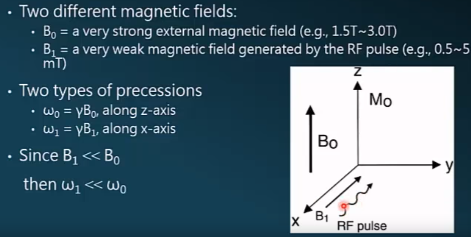
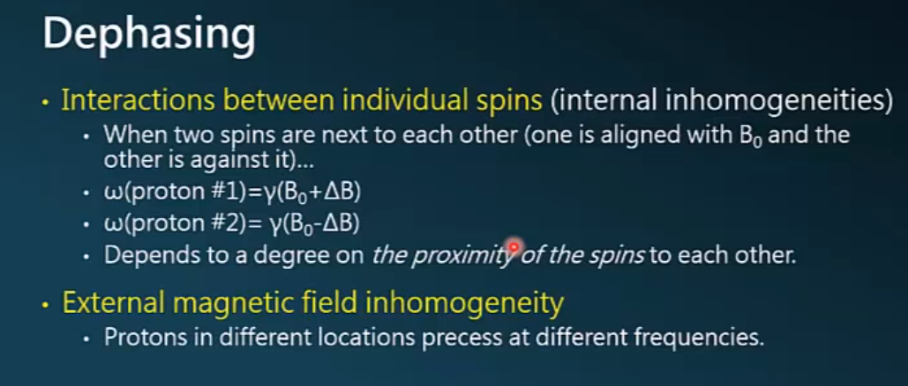
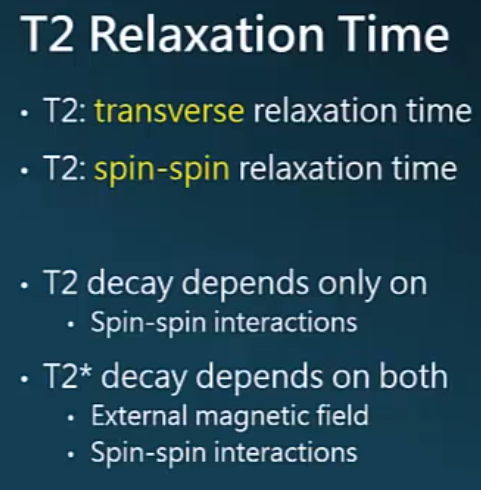
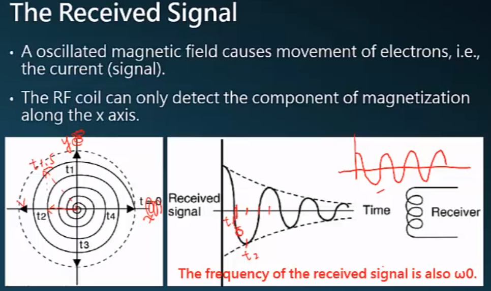
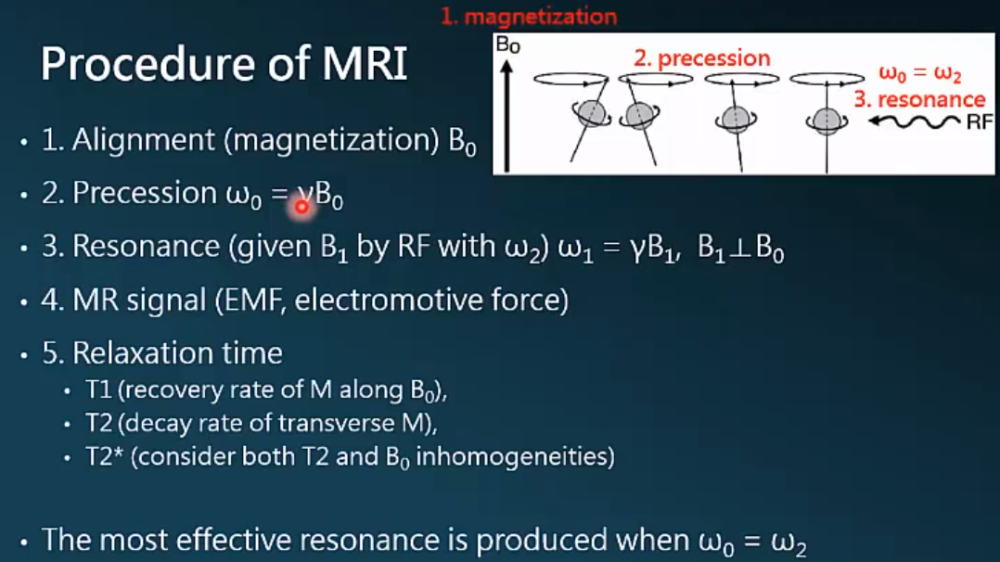
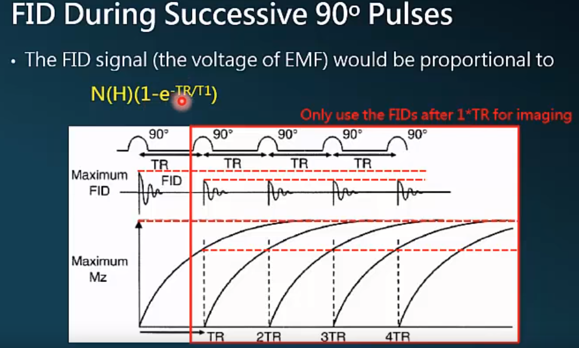
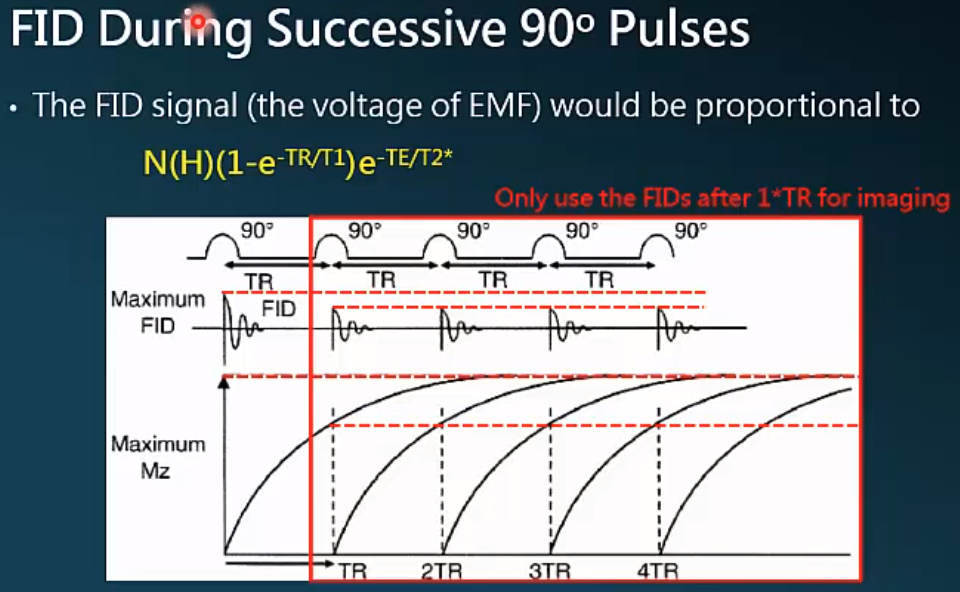
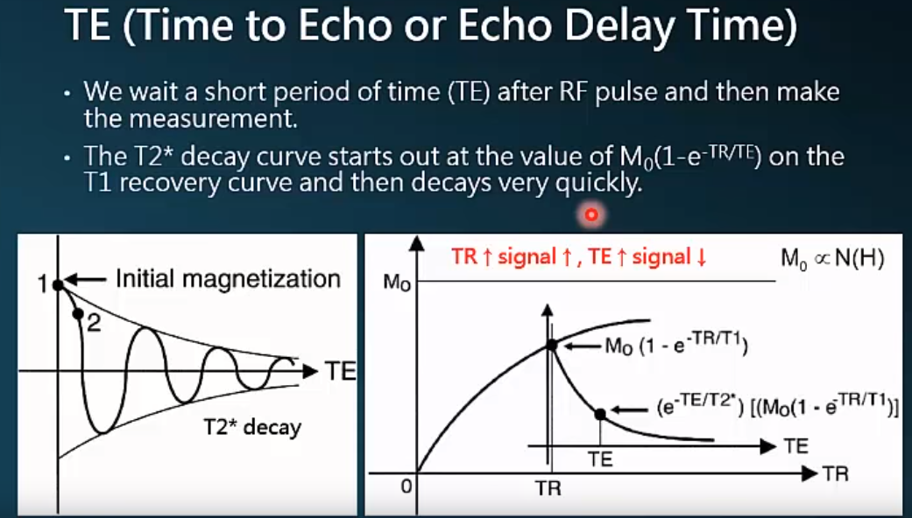
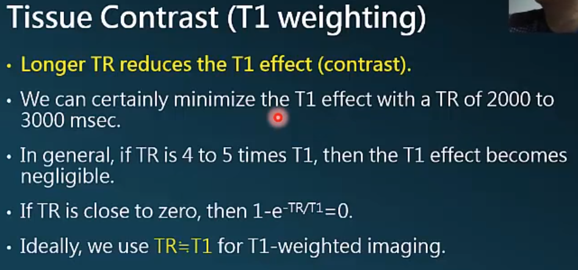

# BASICS

* any spinning charged particle creates an electromagnetic field.

* use spin quantum number can calculate state number of different spins.

* An MDM (Magnetic dipole moment) is found in any nucleus with an odd number of protons, neutrons, or both. *MDM is the signal source or MRI*.

* **Gyromagnetic Ratio** $\gamma$: while applying an unit magnetic, how high the angular frequency occurs.

*Why use hydrogen nucleus in MRI?*

there are two reasons: 1. its abundance (60%~70% of body is water); 2. its high MR sensitivity (high gyromagnetic).

*Magnetic substances*

* Diamagnetic, most tissue in body are diamagnetic.
* paramagnetic, dipole-dipole interactions cause $ T_1 $ shorting (bright signal on $T_1$-weighted images)
* Ferromagnetic ($\chi >> 0$ and $\mu > 1$), Iron (Fe), cobalt (Co), and nickel(Ni)

**NMR is paramagnetic, while bulk water is diamagnetic.**

# Basic principle of MRI

Types of imaging

* Reflection: PHOTOGRAPHY, ultrasound

* Penetration: X-RAY

* Emission: PET, SPECT, MRI

$T_1$ depends on the tissues (though it is the procession of hydrogen, while the amount in different tissues is different).  Also depends on $B_0$. Here there is something confused.

**~longer $T_1$ at higher field $B_0$~**

**What is the number of resonant protons that are available to transfer energy to the lattice?**

Increase the magnetic field strength $B_0$, the Larmor frequency will increase, then fewer protons experience an oscillating magnetic field at or near Larmor frequency. So, fewer protons available to transfer energy efficiently to the lattice, and the $T_1$ time is lengthened.

# RF pulse

The individual spins are processing along z-axis and out of phase with each other (while introducing $B_1$, spinning protons will be in phase).

The x and y components cancel each other out.

Two type

During procession, $\omega_1 << \omega_0$. (绕z和绕x旋转的速度有很大很大的差别)

* $B_0$ is a fixed magnetic field (much like a DC voltage)

* * $B_1$ is an oscillating magnetic field (much like an AC voltage)

Only oscillating magnetic field can induct current (can be detected). If RF direction is along Z, oscillating will be to small comparing with $B_0$, so even small inhommeation will make the noise much bigger than signal coming from RF.

One of important function of $B_1$: by introducing $B_1$, the spinning protons will then be in phase, creates transverse magnetization (可以理解为有一种向心力使protons维持在与x轴垂直的平面上，于是会使out of phase的protons加速或者减速微调从而in phase). The other one is let spinning protons be in phase.

*$180^\circ$ RF pulse*

A $180^\circ$ FR pulse exactly reverses the equilibrium northward pointing excess **without inducing phase coherence**

# $T_1$, $T_2$, $T^{\star}$

* $T_1$ and $T_2$: inherent properties, fixed for a specific tissue at a given $B_0$ strength. **$T_2$ decay occurse 5 to 10 times more rapidly than $T_1$ recovery**

* $T_2^{\star}$: the effects of $T_2$ and homogeneity in the $B_0$. Fixed for a specific tissue within a given external magnetic environment.

$T_1$: longitudinal relaxation time.

$T_1$: teh spin-lattice relaxation time.

After the RF pulse is turned off, there are two things happening:

1. the spins will go back to the lowest energy state;
2. the spins will get out of phase with each other.

**Relaxation**: teh spins are relaxing back into its lowest energy state or back to the equilibrium state from higher energy state.

$\delta B_{internal}$: $T_2$.

$\delta B_{exteranl}$: $T_2^{\star}$

To Shimming, one can use gradient coil to make.

# TR & TE

TR and TE can be controled and adjusted by operator. But T1 and T2 can not be done that, because they are inherent properties of the tissue.

By adjusting TR and TE, we can put more weighted on T1 or   T2.

T1 (T2) is defined as the time when $63\%$ of the longitudinal (transverse) magnetization has recovered. $3T1 (3T2) = 95\%$ recovery (decay).

Only use the FIDs after the first TR for imaging.

Once RF pulse stopped, signals will be affected by $T_2^\star$, that's why the signal equation is $N(H)(1-e^{-TR/{T_1}})\times T_2^{\star}$.

**TE: time to echo or echo delay time.**

TR increases, signal is strong. TE increases, signal decreases.

If we want to get a $T_1$ weighted image, we can make a short TR, usually we choose TR between TR1 and TR2.

Short TE reduces $T_2^\star$ effect (contrast)!

**Image Contrast**

* Proton density: longer TR, short TE;
* $T_2^\star$: longer TR, long TE;
* T1: short TR, short TE;
* No signal: short TR, long TE.

# Clinical application of Tissue contrast

# Fast MRI Notes
## Fast spin echo, FSE

FSE has different names in different companies.

* RARE: raped acquisition with relaxation enhancement (这个是最先发明时的名字)
* FSE: fast spin echo (for GE, Hitachi, Toshiba)
* TSE: turbo spin echo (for Siemens, Philips)

* SSFSE： single shot FSE. (变形版本的FSE, FSE 在一个TR中填充完很多个rows, 但是SSFSE是一口气填充完一个slice，很疯狂！)

* HASTE: half-Fourier acquisiton single-shot turbo spin-echo.

## Gradient-recalled echo, Gradient

